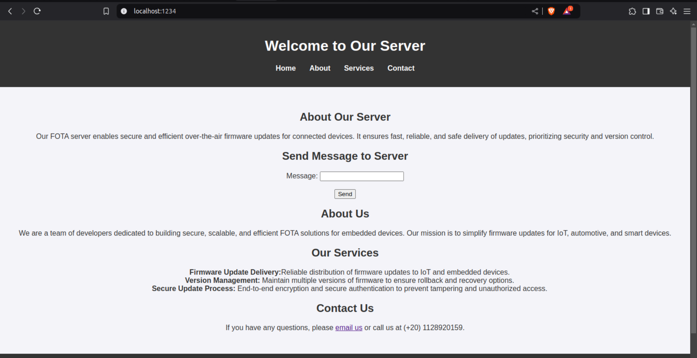

# Qt Server on Port 1234

**Overview**

This is a simple Qt-based server that listens on port 1234. It handles incoming HTTP requests and sends appropriate responses.

## **How to Run**

### 1) Compile the Project:

1. Ensure you have a Qt development environment set up.
2. in `main.cpp` replace the `index.html` file path with your absolute path.

3. Compile the project using your preferred build system (e.g., qmake, CMake).

This will generate an executable file.

### 2) Run the Executable:

```bash
./302-NinjaServer
```

--- 
---

## **How To Test**
---


### 1) Using `curl` Command

```bash
curl http://localhost:1234
```
This command should get you the index.html file content

```bash
curl -X POST -d "message=abaaaaas" http://localhost:1234
```
This command sends a message to the server, so the message should be appear to you.

###  2) Form Any browser

Open a new tap and type

```
localhost:1234
```

This web page should appears to you


And If you try to send a message it should appears to you on the terminal

---
---

## **How it Works**
- `Socket Creation:` A TCP socket is created to listen on port 1234.
- `Server Start:` The server starts listening for incoming connections.
- `Client Connection:` When a client connects, a new socket is created to handle the connection.
- `Request Handling:` The server reads the HTTP request from the client. The request is parsed to extract the method, path, and headers.
- `Response Generation:` The server processes the request and generates an appropriate HTTP response. The response includes the status code, headers, and the response body.
- `Response Sending:` The response is sent back to the client through the socket.